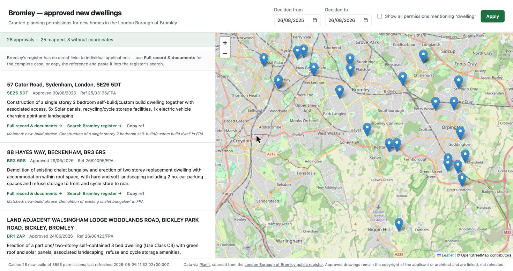

# Bromley — approved new dwellings

A local website listing **granted planning permissions for new homes in the London Borough of
Bromley**, with the address, postcode, decision date, full proposal description, a map, and a route
through to the case documents.



## Where the data comes from

The obvious source is not the right one, so this is worth stating plainly:

| Source | Verdict |
| --- | --- |
| `planning.data.gov.uk` | **Unusable.** The gov.uk planning platform publishes designations (conservation areas, listed buildings, brownfield registers) — not planning applications. |
| Bromley's own register (`planningaccess.bromley.gov.uk`) | **No API.** A Salesforce/Arcus portal, rendered client-side, searchable only through its own form. |
| GLA Planning London Datahub | **Too stale for Bromley.** Its newest Bromley decision is 30/10/2025, and 2025 holds 2,244 records against ~5,000/yr previously. |
| **PlanIt** (`planit.org.uk/api`) | **Used.** Scrapes Bromley's register and serves clean JSON, current to within a few days. |

PlanIt is therefore the feed, and Bromley's register remains the underlying authority.

## Why there is a classifier

Searching the keyword `dwelling` alone is close to useless. Over the 12 months to August 2026
Bromley issued **3,559 permissions**; 44 of them mention "dwelling", and only **28** are actually new
houses. The rest are extensions *to an existing dwelling*, outbuildings, tree works and lawful
development certificates.

`app/classify.py` therefore applies three tests:

1. the description mentions `dwelling` (your keyword);
2. it matches a build phrase — *erection / construction / redevelopment / demolition* leading to a
   dwelling, house, bungalow or home;
3. the Bromley reference suffix is a real permission — `FPA`, `OUT`, `NOT`, `S73A` are kept;
   `HPA` (householder), `TCA`/`TPO` (trees), `ADV`, `CON*` (conditions), `LDC` (certificates) and
   `AMD` (amendments) are dropped.

**Every permitted application is stored, not just the survivors**, each with a
`classification_reason`. Widening the filter is a query change, never a re-scrape, and the site shows
you the reason it matched so a wrong call is visible rather than silent.

## Running it

```bash
python3 -m venv .venv
.venv/bin/pip install -r requirements.txt

# Backfill a year of decisions (~8 paginated requests, about a minute)
.venv/bin/python -m app.refresh --from 2025-08-26 --to 2026-08-26

.venv/bin/python -m uvicorn app.main:app --port 8000
```

Then open <http://127.0.0.1:8000>.

### Keeping it current

```bash
.venv/bin/python -m app.refresh          # last 30 days of decisions
```

Re-running over an overlapping window is safe — records upsert on their reference. To automate it,
add a cron entry yourself:

```cron
0 7 * * * cd /path/to/bromley-planning && .venv/bin/python -m app.refresh >> data/refresh.log 2>&1
```

## API

| Endpoint | Purpose |
| --- | --- |
| `GET /api/applications` | New-build approvals. `decided_from`, `decided_to`, `include_all=true`. |
| `GET /api/status` | Cache size, decision-date range, last refresh — so staleness is visible. |

The web app reads **only** from the local SQLite cache (`data/bromley.db`). It never calls PlanIt at
request time; PlanIt rate-limits, and only the refresh job talks to it, backing off on 429.

## Getting to the plans

Each result links to its **full record and documents** on PlanIt, and offers the application
reference for Bromley's register search.

Bromley's register has no working per-application link. PlanIt captures a Salesforce record URL for
each case, but those IDs do not resolve publicly — they render *"Invalid Page"* (verified against
`25/05448/FPA`, decided June 2026). The URL is still stored in `bromley_url` in case that changes,
but it is deliberately not presented as a link. To reach the drawings on the council's own site,
copy the reference from a card and paste it into the register's quick search.

Approved drawings are the copyright of the applicant or architect. This site links to them; it does
not rehost them.

## Limitations

- Coverage depends on PlanIt's scrape of Bromley's register. If the portal changes upstream, the feed
  can stall — `/api/status` and the page footer surface the last refresh time.
- The classifier is heuristic. `classification_reason` is stored on every record so a
  misclassification can be diagnosed and the rules tightened.
- Conversions and change-of-use that create homes are stored but hidden, per the new-build-only
  brief. Tick **Show all permissions mentioning "dwelling"** to see them.
- Three of the 28 new-build records have no coordinates from the feed and cannot be mapped; the
  result count says so explicitly rather than quietly dropping them.
# bromley_planning_website
